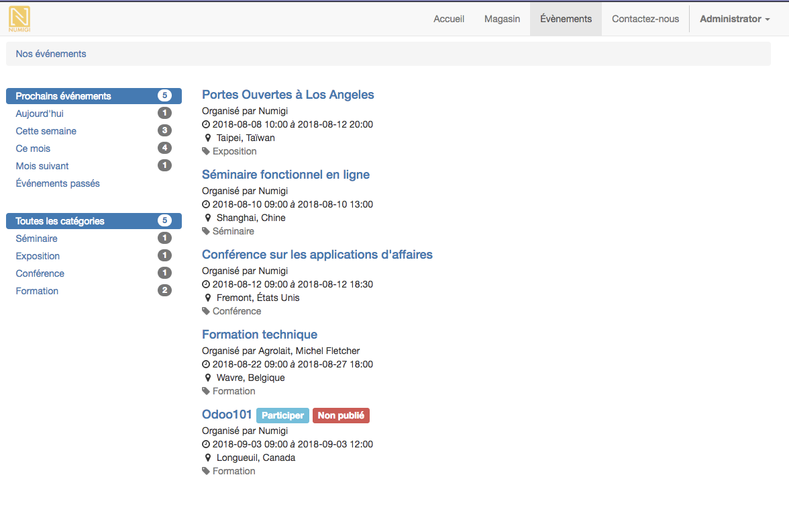

# Untitled

Formations et événements sous Odoo

## Contexte

Le but est d’être en mesure d’utiliser l’application événement afin de gérer notre offre de formation ainsi que d’autres événements pouvant intéresser des partenaires.

## Les événements sous Odoo

Les événements se gèrent via l’Application EVENTS. Celle-ci permet de définir des événements pour lesquels une gestion des invités sera effectuée.

Chaque événement a obligatoirement une date&heure de début et de fin.

Il est possible de configurer des informations additionnelles comme:

* Une catégorie d’événement
* Un lieu
* Un nombre minimum et maximum de participants

L’événement permet la configuration de différents types de tickets gérés à l’aide d’article de vente dans Odoo. L’article ayant lui un prix de vente et permettant la génération d’un ordre de vente \(SO\) pour l’achat du ticket par le partenaire.

Les événements ont également la possibilité d’être actif ou non ainsi que publié ou non sur le site web.

## Les événements sur le site

Les événements peuvent être affichés sur le siteweb lié à Odoo.

Ils sont affichés sur une page dédié du site.

Cela permet deux choses:

* La visibilité des informations
* L’inscription & achat de ticket

Les informations sont éditables comme les autres pages web de l’application à partir du CMS inclus.

